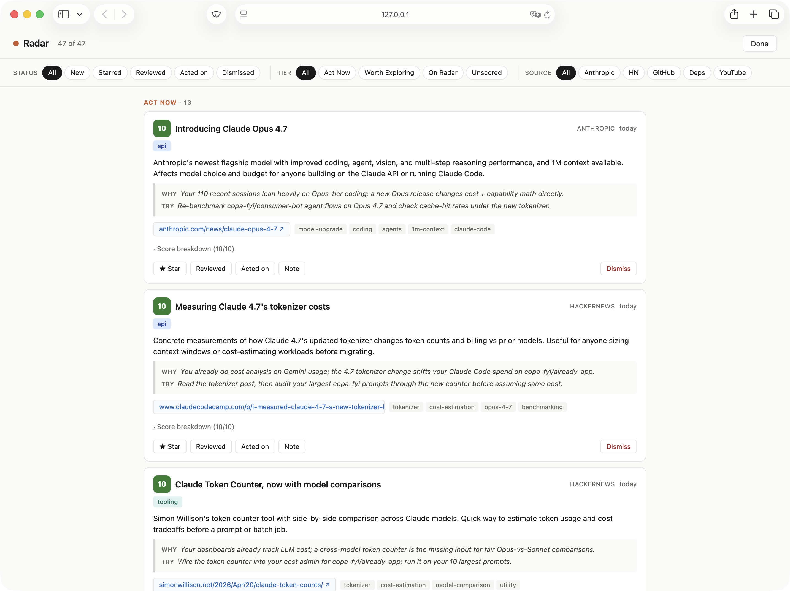

# Radar

Your AI development radar for Claude Code.

The AI tooling landscape changes every week. New Claude Code features ship, your dependencies release major versions, MCP servers multiply, and frameworks you depend on pivot — all while you're heads-down shipping.

Radar watches the ecosystem for you, then tells you which of it matters **based on what you're actually doing** — your prompts, your tool calls, your failed commands, your active projects. Not a generic newsletter. Every recommendation is grounded in your own Claude Code and Cowork session history, parsed locally.

## Install

```bash
/plugin marketplace add flippyhead/radar
/plugin install radar@flippyhead/radar
```

Works with Claude Code. Zero setup. All data stays local.

## Personalized to Your Actual Work

Most "ecosystem digest" tools show you the same news everyone else sees. Radar grounds every recommendation in **your own session history**:

- **Claude Code sessions** — every prompt, tool call, and failure from `~/.claude/projects/**`
- **Cowork sessions** — your chats and workspace history, parsed alongside Claude Code
- **Installed environment** — MCP servers in `.mcp.json`, allowed tools in `settings.json`, installed plugins
- **Stated goals** — anything you've written in `CLAUDE.md` about priorities or focus areas
- **Dismissal history** — what you've rejected before and why (learns your taste over time)

The scoring rubric is explicit about this: `usageGap` gives top marks when session data shows you're doing something manually that a discovered tool automates. `goalAlignment` rewards items that connect to projects you're actively working in. An item that's hot on Hacker News but doesn't connect to your work scores low and gets filtered out.

All parsing happens on your machine. No session data is uploaded anywhere.

## What You Get

### Ecosystem scan + personalized recommendations

Run `/radar` to scan external sources and get scored recommendations matched to your workflow:

```
Scan complete: 12 new items catalogued
  — 3 from Anthropic changelog
  — 6 from dependency changelogs (57 releases across 16 repos)
  — 3 from AI ecosystem news

Recommendations:

▸ Act Now

  1. Claude Code 1-hour prompt caching — Score: 9/10
     Triggered by: 55 Claude Code sessions last week, long contexts,
     repeated use of the same skills → high cache-miss cost.
     → Next step: Add ENABLE_PROMPT_CACHING_1H=1 to settings.json env.

  2. @posthog/ai v7.16.0 — Score: 7/10
     Triggered by: @posthog/node in 3 of your projects, recurring prompts
     about "token usage" across sessions.
     → Next step: Check @posthog/ai docs, evaluate for your AI features.

▸ Worth Exploring

  3. Drizzle ORM v1.0.0-beta.21 — Score: 6/10
     Approaching 1.0 stable. Validators consolidated into core.
     You use Drizzle — don't upgrade to beta in prod, but track it.

  4. AI SDK v7 beta — Score: 5/10
     Progressing but not stable. Stay on v6, monitor for GA.

▸ FYI — Market Context

  Cursor hit $2B ARR. Claude Code tied at 18% developer adoption.
  The AI coding tool market is converging on the agent paradigm.
```

Each recommendation leads with a **Triggered by:** line citing the specific pattern from your Claude Code and Cowork sessions that made it score highly. Scoring weighs **goal alignment**, **usage gap** (manual work a tool would automate), **recency**, and **effort/impact**.

### Workflow insights from your sessions

Run `/radar-analyze` to parse your Claude Code and Cowork session history and surface patterns you'd never notice yourself:

```
Analyzed 55 sessions (7 days), 8,596 tool calls across 6 projects.

Insights:

  ⚡ Direct Automation
  You said "yes" or "ok" 70 times this week — likely permission
  confirmations. Check which MCP tools trigger these and add them
  to allowedTools.
  Effort: low | Impact: medium

  ⚡ Direct Automation
  /fix-pr-reviews was invoked 71 times. The skill supports
  "/loop 10m /fix-pr-reviews" for automatic monitoring — you're
  doing it manually.
  Effort: low | Impact: medium

  📊 Decision Support
  Top 3 projects by time: copa-fyi (22 sessions), consumer-bot (15),
  already-app (14). Your strategic priority says "Consolidate" but
  you're actively working 4+ projects. Time for a prioritization call?
  Effort: low | Impact: high
```

Insights are categorized by module — **root cause diagnosis**, **direct automation**, **decision support**, and **knowledge nudges** — each with concrete next steps.

### Manage your catalogue

Run `/radar-review` to browse discoveries and insights in a local web UI. Star things worth pursuing, dismiss noise, add notes, filter by status, tier, or source. When you dismiss an item, pick a reason tag — Radar reads those tags on the next `/radar-recommend` and down-weights items that match your dismissal patterns.



## How It Works

- **Scan** — pulls from dependency changelogs across all your local projects, Hacker News (targeted queries + high-point firehose), GitHub, Anthropic changelog, YouTube, and a people-to-watch list (Karpathy, Simon Willison, et al.). Deduplicates against your existing catalogue.
- **Score** — parses your Claude Code (`~/.claude/projects/**`) and Cowork sessions locally, then matches each discovery against that data plus installed MCPs, allowed tools, and `CLAUDE.md` goals. Weighted scoring on goal alignment, usage gap, recency, and effort/impact — with a negative prior from past dismissals.
- **Persist** — everything goes to `~/.claude/radar/catalogue.json`. Single local JSON file, you own it. No accounts, no servers, no external dependencies. Future adapter plugins can sync to Notion, Linear, or anywhere else.

## Commands

| Command | What it does |
|---------|-------------|
| `/radar` | Scan ecosystem + get personalized recommendations |
| `/radar-analyze` | Analyze your recent coding sessions for workflow insights |
| `/radar-scan` | Scan external sources only (no recommendations) |
| `/radar-recommend` | Score and recommend from existing catalogue |
| `/radar-review` | Browse, star, dismiss, and annotate your catalogue |

## Upgrading

From `claude-workflow-analyst`:

```bash
/plugin marketplace remove flippyhead/claude-workflow-analyst
/plugin marketplace add flippyhead/radar
```

Radar migrates your existing catalogue when you first run `/radar-scan` or `/radar`.

## License

MIT
